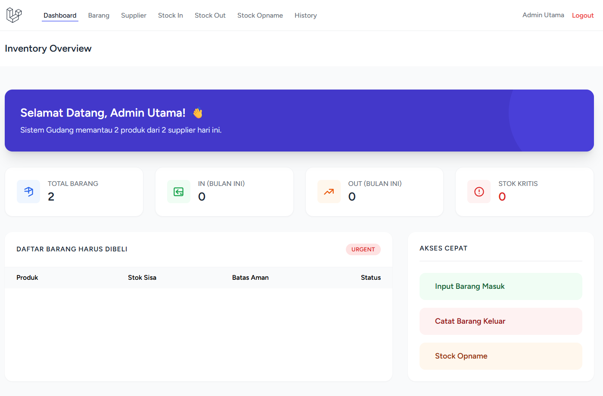

# Warehouse Stock Management System

[](https://laravel.com)
[](https://opensource.org/licenses/MIT)

Sistem manajemen inventaris modern yang dirancang untuk memudahkan pencatatan barang masuk (**Stock In**), barang keluar (**Stock Out**), hingga penyesuaian stok (**Stock Opname**) secara real-time dan akurat.

---

##  Preview

*Tampilan Dashboard Utama Sistem Inventaris*

---

##  Fitur Unggulan

*   **Audit Trail (History)**: Mencatat setiap pergerakan stok lengkap dengan data user yang melakukan transaksi.
*   **Stock Service**: Logika stok terpusat menggunakan *Database Transaction* untuk menjaga integritas data.
*   **Export Excel**: Laporan Master Barang, Riwayat Transaksi, dan Stock Opname yang siap unduh.
*   **Role Management**: Pembagian akses antara Admin (Full Access) dan Staff (Limited).
*   **Stock Alert**: Notifikasi visual untuk barang yang mencapai ambang batas stok minimum.

##  Tech Stack

- **Framework**: Laravel 12
- **Styling**: Tailwind CSS
- **Database**: MySQL / PostgreSQL
- **Icons**: Phosphor Icons
- **Package**: Maatwebsite Excel (untuk laporan Excel) - Spatie Permission (untuk role) - Laravel Breeze ( Authentication ).

##  Instalasi Lokal

Ikuti langkah berikut untuk menjalankan project ini di komputer kamu:

1. **Clone Repository**
   ```bash
   [git clone [https://github.com/username-kamu/nama-repo.git](https://github.com/username-kamu/nama-repo.git)](https://github.com/Rezawirakusuma5247/Inventory.git)
   cd nama-repo

2. **Instal Dependencies**
   ```bash
   composer install
   npm install && npm run build

4. **Konfigurasi Environment**
   ```bash
   cp .env.example .env
   php artisan key:generate

6. **migrate & seed*
   ```bash
   php artisan migrate --seed

8. Serve jalankan secara lokal
   ```bash
   php artisan serve
